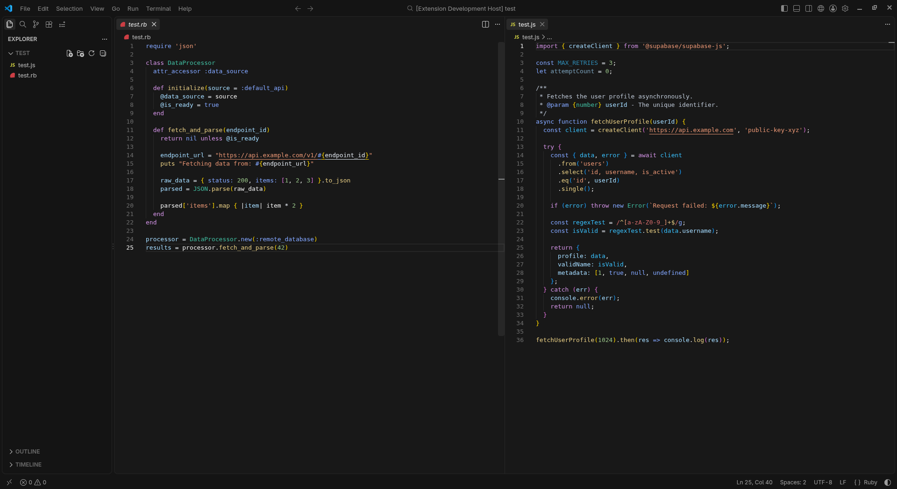
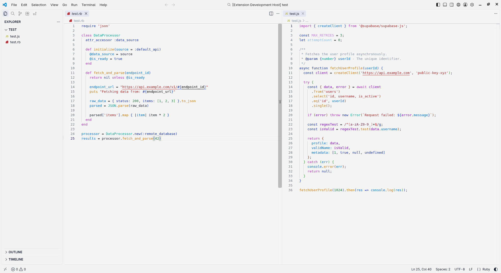

# Modern Minimal Theme

A clean, light theme for Visual Studio Code designed to maximize code readability and minimize visual distractions.

## Preview

## Installation

1. Open Visual Studio Code.

2. Press `Ctrl+Shift+X` (Windows/Linux) or `Cmd+Shift+X` (macOS) to open the Extensions view.

3. Search for **Modern Minimal Theme**.

4. Click **Install**.

5. Go to **Preferences: Color Theme** (`Ctrl+K Ctrl+T` / `Cmd+K Cmd+T`) and select **Modern Minimal Theme**.

## Features

* Calibrated contrast for a comfortable coding experience in bright environments.

* Harmonized syntax highlighting for major programming languages.

* Clean and unobtrusive UI elements (Explorer, Terminal, Status Bar).

## Feedback and Issues

If you find any bugs or have suggestions for improvements, please feel free to open an issue on the [GitHub Repository](https://github.com/noepoirier/modern-minimal-theme).